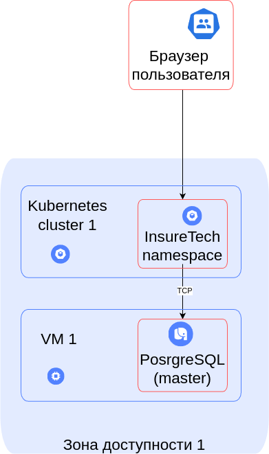
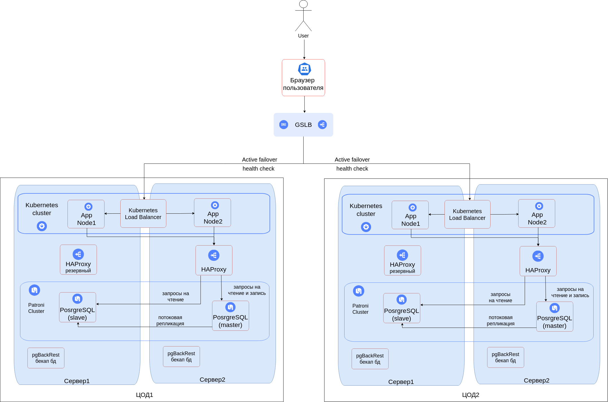

# Проектирование

## Проектирование технологической архитектуры

Компания планирует активное расширение в регионах России. Ожидается значительный рост числа пользователей и объёма обращений к системе. Необходимо обеспечить стабильную и бесперебойную работу сервиса в режиме 24/7, при этом пользователи из всех часовых поясов должны получать одинаково быстрый отклик приложения.

### Основные требования

* **RTO (Recovery Time Objective)** — максимально допустимое время недоступности системы: **45 минут**.
* **RPO (Recovery Point Objective)** — допустимая потеря данных не более чем за **15 минут** до момента сбоя.
* **Доступность** системы должна составлять **99,9%**.
* **Время загрузки страниц** должно быть одинаковым для всех пользователей, независимо от их региона или расстояния до дата-центра.

В системе хранится относительно небольшой объём данных — порядка **50 ГБ**, включая:

* основную информацию о клиентах (ФИО, контакты, документы);
* данные о страховых продуктах и тарифах;
* историю заявок и оформленных полисов.

## Разработка решения

Для обеспечения высокой доступности и отказоустойчивости рассматриваются две основные стратегии **аварийного переключения (failover)**:

* **Active-Active** — приложение работает одновременно на нескольких площадках, и пользовательский трафик распределяется между ними.
* **Active-Standby (Passive)** — приложение развёрнуто на двух площадках, но активна только одна; резервная находится в ожидании и активируется при отказе основной.

С учётом бизнес-требований и целевого уровня доступности **99,9%**, оптимальной является **Active-Active-архитектура**, так как она обеспечивает минимальные задержки и исключает простой во время переключения на резервную площадку.

### Ключевые элементы архитектуры

* **Глобальный балансировщик нагрузки (GSLB)** — распределяет трафик между дата-центрами в разных географических регионах, обеспечивая георезервирование и маршрутизацию запросов по принципу наименьшей задержки (latency-based routing).
* **Кластер Kubernetes** — развёрнут в распределённой конфигурации и поддерживает горизонтальное масштабирование. Встроенные механизмы балансировки нагрузки обеспечивают устойчивую работу при росте числа запросов.
* **Кластер PostgreSQL на Patroni** — реализует отказоустойчивую базу данных с синхронной репликацией между узлами и возможностью горизонтального масштабирования.
* **HAProxy** используется в качестве балансировщика для подключения к кластеру базы данных: он получает информацию о текущем мастере через API Patroni и перенаправляет запросы на активную ноду.
* **HAProxy** также развёрнут в резервной конфигурации, что исключает единую точку отказа и повышает надёжность соединений с базой данных.

## Гео-распределенная архитектура

### Изначальная схема

### Схема итогового решения

[<- На главную страницу](../ReadMe.md)
