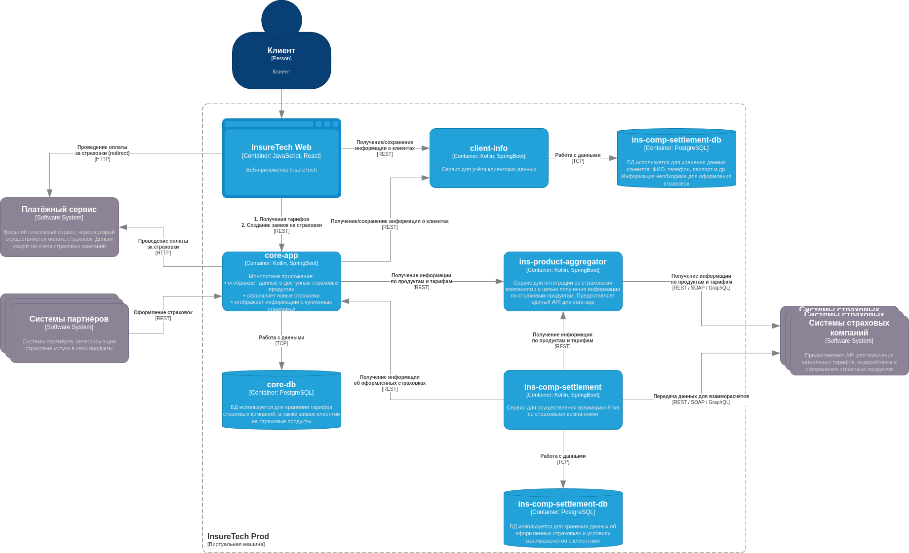
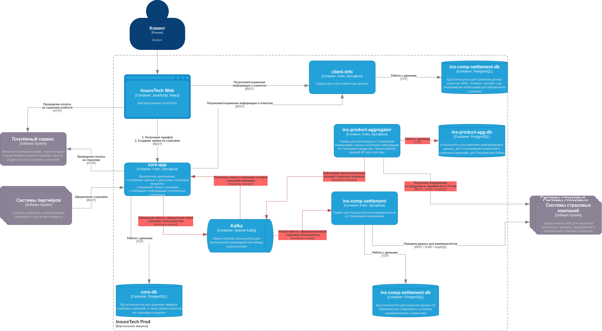

# Переход на Event-Driven архитектуру

## Описание перехода на Event-Driven архитектуру

Сервисы **core-app** и **ins-comp-settlement** получают информацию о доступных страховых продуктах через REST API сервиса **ins-product-aggregator**.
В момент запроса агрегатор:

* обращается к API всех страховых компаний (сейчас их пять),
* объединяет полученные данные в единый список,
* возвращает этот список в рамках того же синхронного вызова.

Чтобы повысить производительность, при первоначальной реализации команда решила хранить локальные копии данных о продуктах и тарифах внутри сервисов **core-app** и **ins-comp-settlement**.
При этом:

* **core-app** обновляет данные каждые 15 минут;
* **ins-comp-settlement** — один раз в сутки (во время ночной обработки реестров страховок).

В процессе периодически возникают ошибки — в основном из-за задержек или нестабильности API страховых компаний.
Дополнительно **ins-comp-settlement** раз в сутки делает запрос в **core-app**, чтобы получить список оформленных за день страховок, необходимые для расчетов и отчетности.

В ближайшее время **InsureTech** планирует подписать соглашения ещё с пятью страховыми компаниями, что приведёт к росту нагрузки и увеличению вероятности ошибок. Необходимо спроектировать решение, которое устранит текущие узкие места и обеспечит масштабируемость системы.

## Задачи

1. **Проанализировать текущую архитектуру**
   Подготовить документ с описанием существующих проблем и рисков, связанных с ростом нагрузки.
   Готовый файл разместить в директории `Task3` в рамках пул-реквеста.

2. **Разработать обновлённую диаграмму контейнеров InsureTech**, которая предложит решения для выявленных проблем.
   При этом:

   * не менять текущую функциональную декомпозицию между сервисами;
   * определить, какие взаимодействия следует перевести на событийное взаимодействие (Event Streaming);
   * рассмотреть применение паттерна **Transactional Outbox**.

   Готовую диаграмму также необходимо загрузить в директорию `Task3`.

## Проблемы и риски текущей архитектуры

В существующей реализации монолит **core-app** каждые 15 минут запрашивает актуальные данные у **ins-product-aggregator**,
который, в свою очередь, обращается к API страховых компаний.
Эти данные необходимы для поддержания актуальности базы и корректного отображения страховых предложений пользователям.

Сервис **ins-comp-settlement** раз в сутки также делает запросы к **ins-product-aggregator** и **core-app**,
чтобы получить новые заявки и актуальные тарифы. После этого он проводит расчёты и взаимодействует с внешними платёжными системами.
Такой подход создаёт периодические пики нагрузки и потенциальные точки отказа.

## Риски увеличения нагрузки на внешние системы

* Рост объёма данных, возвращаемых агрегатором монолиту.
* Увеличение количества обращений к внешним API страховых компаний.
* Повышенная связанность между сервисами.
* Рост вероятности ошибок и недоступности внешних систем.
* Повышение общей нагрузки на все компоненты цепочки.
* Отсутствие гарантированной доставки данных при синхронных запросах (раз в 15 минут или раз в сутки).
* Невозможность применения гибких механизмов повторной обработки в случае ошибок — сбой одного запроса прерывает процесс целиком.
* Существенная пиковая нагрузка на **ins-product-aggregator** и **core-app** во время ночных запросов **ins-comp-settlement**.

Для повышения надёжности рекомендуется применить **паттерн Transactional Outbox** в сервисе **ins-product-aggregator**.
Это позволит избежать потери событий при сбоях и гарантировать корректную доставку данных.

## Диаграмма компонентов системы as-is

## Диаграмма компонентов системы to-be

