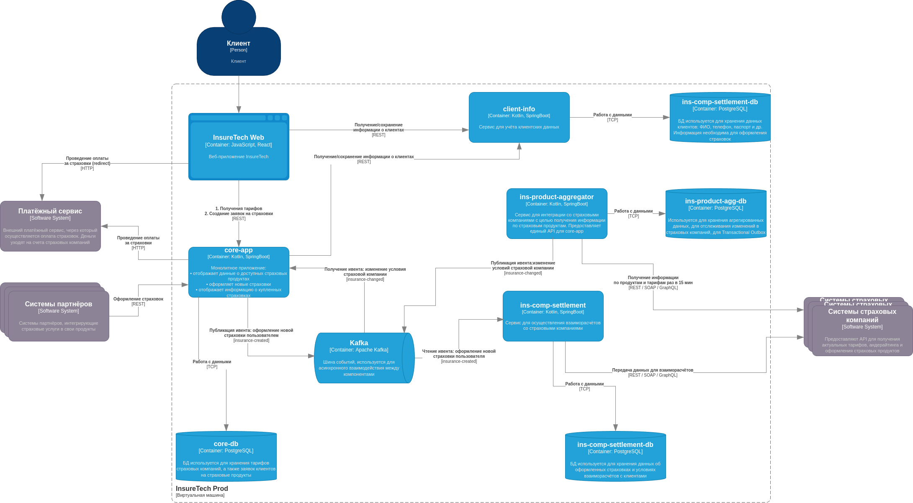
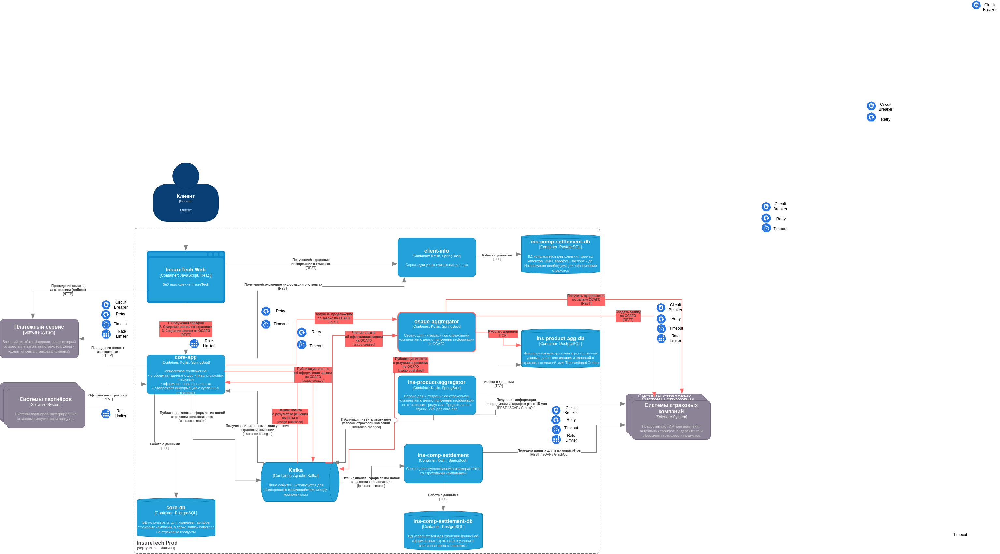

# Продажи ОСАГО

## Проектирование процесса продажи ОСАГО

Компания планирует запуск нового продукта — **онлайн-оформление ОСАГО**.
Пользовательский сценарий выглядит следующим образом:

1. Клиент заполняет заявку с данными об автомобиле.
2. После отправки заявки сервис обращается ко всем доступным страховым компаниям, чтобы получить предложения, соответствующие параметрам клиента.
3. Важно, чтобы предложения от страховых компаний отображались пользователю **по мере их поступления**, а общее время ожидания не превышало **60 секунд**.

Все страховые компании предоставляют унифицированный REST API, включающий два эндпоинта:

* создание заявки на ОСАГО;
* получение предложения по созданной заявке.

Согласно оценке бизнеса, в часы пик количество одновременно активных пользователей, создающих заявки, может достигать **2,5 тыс. человек**.

После обсуждения задачи с командой разработчиков были приняты следующие решения:

1. Сохранить подход, применяемый ранее для получения данных о страховых продуктах и тарифах.
2. Вынести взаимодействие со страховыми компаниями в отдельный сервис — **osago-aggregator**.

Основная задача **osago-aggregator** — отправка заявок в страховые компании и опрос их ответов.
Результаты затем передаются в **core-app**, где реализована бизнес-логика оформления ОСАГО.

Далее необходимо доработать архитектурную схему (из задания 3), отразив в ней решения по следующим вопросам:

1. Архитектура и реализация сервиса **osago-aggregator**.
2. Наличие и назначение его собственного хранилища данных.
3. API, предоставляемое сервисом **osago-aggregator** для **core-app**.
4. Средство интеграции между **core-app** и **osago-aggregator**.
5. API для веб-приложения в составе **core-app**.
6. Средство интеграции между веб-приложением и **core-app** (при необходимости — с обозначением на схеме).
7. Места применения паттернов отказоустойчивости:

   * Rate Limiting
   * Circuit Breaker
   * Retry
   * Timeout
   * Transactional Outbox
8. Учет многократного развертывания сервисов и влияние этого на взаимодействие между ними.

Готовую схему необходимо разместить в директории **Task4** в рамках пул-реквеста.

## Предложенное решение

1. **Хранилище данных для osago-aggregator**
   Сервису потребуется собственное хранилище — аналогичное тому, что используется в `ins-product-aggregator`.
   Оно позволит:

   * отслеживать изменения в предложениях страховых компаний без публикации лишних событий;
   * реализовать паттерн **Transactional Outbox** для гарантированной доставки сообщений;
   * вести аудит изменений условий страховых полисов.

2. **API для core-app**

   * Синхронный REST API — для обеспечения ответа пользователю в течение 60 секунд.
   * Асинхронная передача данных по Kafka — для завершения оформления и дальнейшей обработки событий.

3. **Интеграция между core-app и osago-aggregator**
   Используется схема «точка-точка», поскольку события ОСАГО от `core-app` предназначены только для `osago-aggregator`.

4. **API для веб-приложения в core-app**
   REST API — клиент инициирует сетевые запросы и получает обновления в режиме реального времени.

5. **Интеграция между веб-приложением и core-app**
   REST API без дополнительных протоколов — простота и предсказуемость поведения при высокой нагрузке.

6. **Rate Limiting**
   Ограничение числа исходящих запросов к API страховых компаний для предотвращения перегрузки партнёров.
   Также используется на стороне `core-app`, чтобы защитить систему от чрезмерных обращений клиентов.

7. **Circuit Breaker**
   Применяется для временного прекращения запросов к внешним системам при их недоступности, чтобы избежать каскадных сбоев.

8. **Retry**
   Используется для повторных попыток выполнения синхронных запросов.
   Для предотвращения дублирования предусмотрена передача уникального ключа (идемпотентность).

9. **Timeout**
   Таймауты ограничивают время ожидания ответа от страховых компаний (максимум 60 секунд).
   При превышении лимита пользователю возвращается сообщение об ошибке или временный результат.
   Таймауты также применяются во внутреннем взаимодействии сервисов.

10. **Transactional Outbox**
    Реализуется в каждом сервисе через таблицу `outbox`.
    Обеспечивает гарантированную доставку событий (**at least once**) и защиту от потери данных при сбоях.
    Для идемпотентности каждое событие сопровождается уникальным ключом.

11. **Учёт масштабирования сервисов**
    Все сервисы развернуты в нескольких экземплярах.
    Для корректной обработки событий между инстансами используется уникальный идентификатор события, обеспечивающий идемпотентность и согласованность данных.

## Диаграмма компонентов системы as-is

## Диаграмма компонентов системы to-be

[<- На главную страницу](../ReadMe.md)
